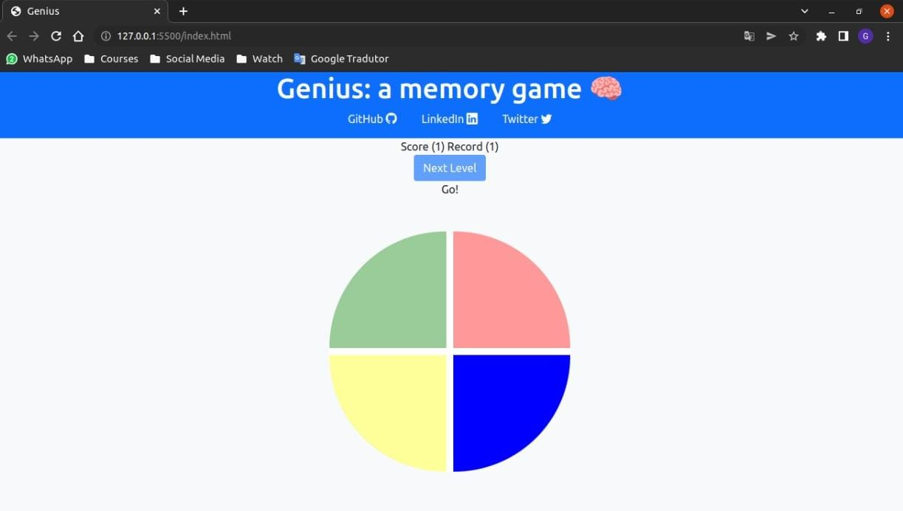

# Genius: a memory game 🧠

## [🎮 Click Here To Play](https://genius-gabrielsanva.vercel.app/)

## About

Hello guys. This is a simple memory game made with HTML, CSS/Bootstrap and JavaScript. Your challenge is to memorize the sequence in which the colors are lit and then repeat the same sequence (which gets longer with each round). Have a good time!

## Example

